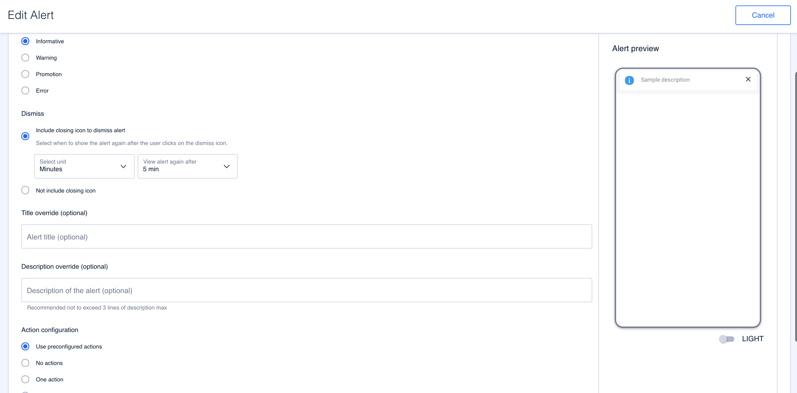
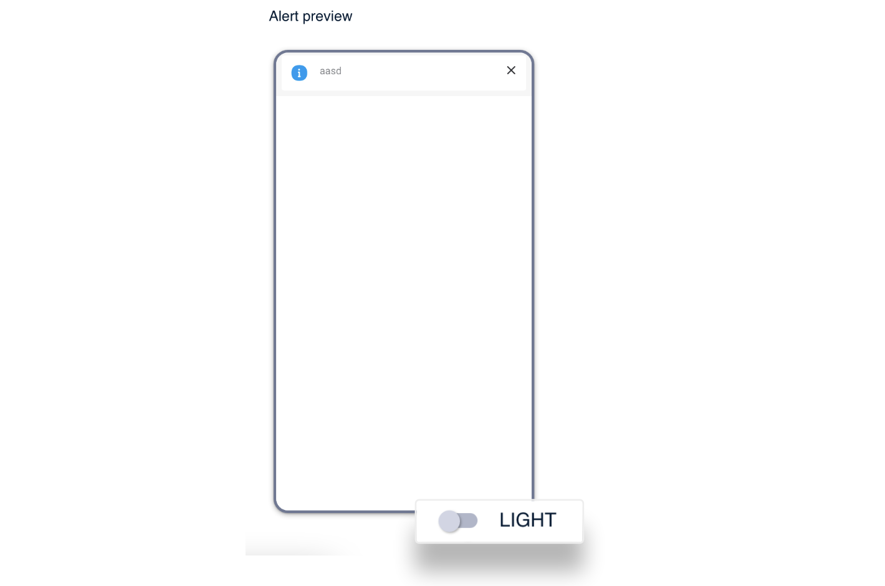

Conteúdo
========

Use este passo para configurar o conteúdo do alerta.

### Content

Preencha os campos necessários:

**Type of alert** . Selecione o tipo de alerta.

* **Informative** . Use este tipo de alerta para fornecer informações ao usuário. 
* **Warning** . Use este tipo de alerta para alertar o usuário e chamar sua atenção, por exemplo, para ações exigem ação de sua parte. 
* **Promotion** . Use este tipo de alerta para exibir promoções ao usuário.
* **Error** . Use este tipo de alerta para exibir algum tipo de erro ao usuário. 

\{% hint style="success" %\}
Os ícones exibidos com cada tipo de alerta não são configuráveis. Você pode utilizar a pré\-visualização da área direita para ver aproximadamente como o alerta será exibido ao usuário.
\{% endhint %\}

**Dismiss** . Use as opções para configurar se o alerta pode ou não ser fechado pelo usuário.

* **Include closing icon to dismiss alert** . Selecione esta opção para permitir que o usuário feche o alerta. 

\{% hint style="warning" %\}
Os alertas somente podem permanecer fechados por um máximo de 1 ano. Após esse período, o alerta é novamente exibido ao usuário, exceto que o alerta seja pausado.
\{% endhint %\}

Indique no menu suspenso **Select unit** quanto tempo passará até o alerta ser exibido novamente, levando em consideração que o tempo máximo é de 12 meses.

* **Not include closing icono** . Selecione esta opção para que o alerta não possa ser fechado pelo usuário. Isto significa que o usuário deverá consumir obrigatoriamente o alerta e fazer o indicado nele para que desapareça.  
  Por exemplo, um alerta indicando ao usuário que não tem saldo não desaparecerá até que ele tenha saldo novamente.

**Title \(optional\)** . Título do alerta. Este é um campo opcional. 

**Description** . Descrição do alerta. É o texto que explica porque o alerta é exibido ao usuário.

\{% hint style="danger" %\}
Se você configurou um alerta como *Preconfigured* no passo anterior, note que esse alerta pode conter un título e que obrigatoriamente contém uma descrição.

Se neste passo 2 você preenche o campo **Title** e/ou o campo **Description** , as informações que o alerta possa conter são substituídas pelas indicadas por você para esses campos.
\{% endhint %\}

**Action configuration** . Indique se o alerta, além de uma descrição, inclui um link de navegação:

* **No actions** . O alerta não contém nenhum link.
* **One action** . O alerta contém um link. Configure para esse link: 
  * **Link text actio** n. O texto que é exibido na tela e que inclui o link associado.
  * **Action navigation to** . Selecione **URL** para configurar uma URL externa ou selecione **Preconfigured** para selecionar uma URL entre as disponíveis.

**Audiences** . Selecione um público se você deseja que o alerta seja exibido apenas para determinados usuários que cumprem as condições desse público. Es un campo opcional. Se você não selecionar nada, o alerta é exibido a todos os usuários que cumprem os requisitos para que esse alerta seja mostrados a eles.

### Alert preview

Use a pré\-visualização para ter uma ideia sobre como o usuário verá o alerta quando este apareça em seu dispositivo.

Use o seletor **LIGHT** para modificar para o modo **DARK** e vice\-versa, e poder pré\-visualizar o alerta quando o usuário estiver no modo escuro.

Clique em **Continue** para ir ao próximo passo.

