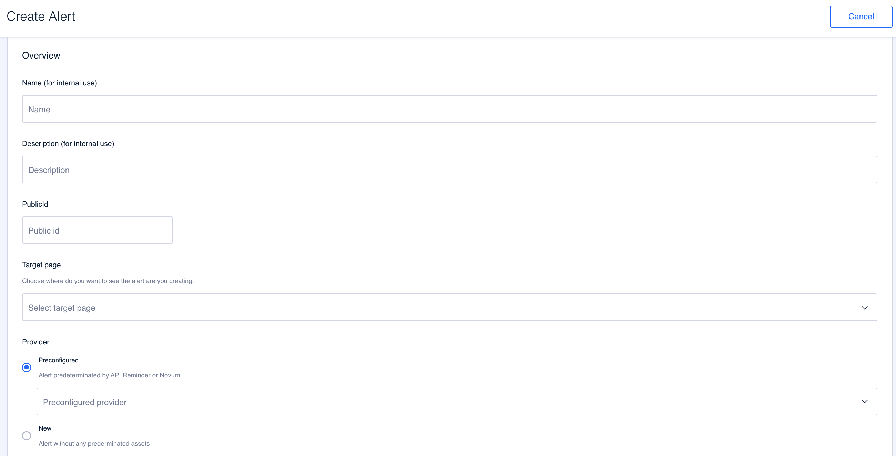

Overview
========

Neste primeiro passo, forneças as informações gerais sobre o alerta que está sendo criado.

Preencha os seguintes campos:

**Name \(for internal use\)** . Nome do alerta que está sendo criado. É um campo de uso interno e, portanto, em nenhum momento será visualizado no app.

**Description \(for internal use\)** . Descrição do alerta que está sendo criado. É um campo de uso interno e, portanto, em nenhum momento será visualizado no app. 

\{% hint style="success" %\}
🤓 Use este campo para descrever o alerta e suas consequências para o usuário. Isto pode auxiliar na identificação do alerta quando a lista estiver completa. Além disso, pode ser útil quando você precisa ordenar os alertas e, portanto, decidir qual deles é mais importante do que outro.
\{% endhint %\}

**Public ID** . Este campo é preenchido de maneira automática quando você completa o campo **Name \(for internal use\)** . Você pode mudar o valor proposto, mas observe que este campo não admite espaços, acentos ou outros caracteres especiais.

**Target page** . Selecione a página em que o alerta será exibido. 

**Provider** . Selecione a origem das informações do alerta:

* **Preconfigured** . As informações do alerta e seu conteúdo provêm por API. Se você decide configurar o alerta através de um fornecedor de informação, selecione\-o no menu suspenso **Preconfigured provider** .
* **New** . O conteúdo do alerta é configurado de forma manual através do CMS no seguinte passo.

Clique em **Continue** para ir ao próximo passo.

