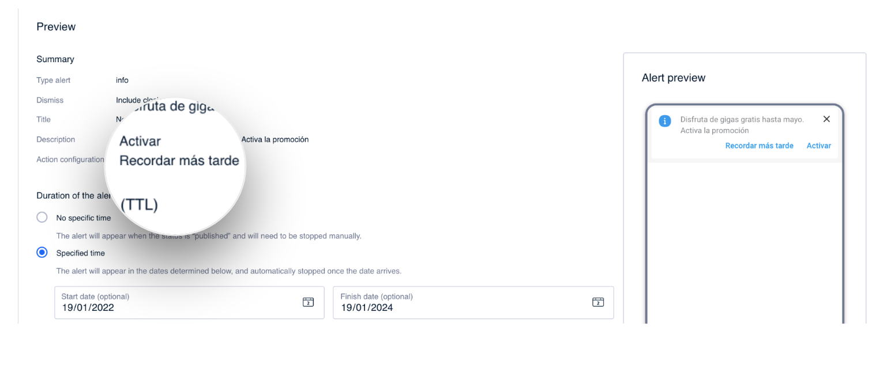

Pré\-visualização
==================

Neste último passo, você possui um resumo do alerta configurado. É também o lugar em que poderá configurar a validade do alerta.

Além disso, você pode iniciar um teste para verificar o conteúdo antes de impactar os usuários.

### Summary

Obtenha um resumo sobre o alerta criado:

* **Type of alert**. Tipo de alerta criado: informativo, de advertência, promocional ou de erro. 
* **Dismiss**. Indique se o alerta foi configurado para ser fechado ou não.
* **Title**. Exibe o título do alerta.   
  👋🏻 No caso de alertas pré\-configurados, não é possível exibir o título e é mostrado *Preconfigured title* como valor para este campo.
* **Description**. Exibe a descrição do alerta.  
  👋🏻 No caso de alertas pré-configurados, não é possível exibir a descrição e é mostrado *Preconfigured description* como valor para este campo.
* **Action configuration**. Se você configurou uma ou duas ações, os textos dos links aparecerão.  
  👋🏻 No caso de alertas pré-configurados, não é possível exibir a descrição e é mostrado *Preconfigured description* como valor para este campo.

### Duration of the alert

Nesta seção, configura, se necessário, o tempo que o alerta será válido.

* **No specific time**. Selecione esta opção se você não deseja configurar uma validade específica para o alerta. Com esta opção, o alerta será exibido ao usuário se o público que está configurado corresponde e se o alerta está Publicado.
* **Specific time**. Selecione esta opção para indicar a data de início e/ou a data de finalização. Neste caso, o alerta será exibido ao usuário apenas nesse intervalo de tempo e desde que o usuário corresponda ao público para o qual o alerta foi configurado e também esteja Publicado.

Clique em **Save** para salvar os campos ou clique em **Save and Publish** para salvar e publicar as mudanças.

### Create test preview (optional)

A partir deste último passo, você também poderá criar um teste para verificar o conteúdo configurado antes de impactar uma ampla massa de usuários. 


🤓 Este passo é opcional, embora seja muito recomendável que, antes de efetuar a publicação de um conteúdo, seja realizado antes.


No campo **User ID (optional)** adiciona um ou mais user IDs, separados apenas com vírgulas (sem espaços), nos quais realizar os testes. Clique em **Create test** para iniciar o teste e poder testar o conteúdo.


**Como obter o user ID** 

1. Certifique-se de ter baixado a versão Enterprise do aplicativo.
2. Abra o app
3. Agite o telefone
4. Acesse a seção "Autentication"
5. o número que você precisa é o do campo **User ID** 

Você precisa mais informações sobre como testar o conteúdo? 👇🏼


[como-hacer-un-test.md](../como-hacer-un-test.md)


