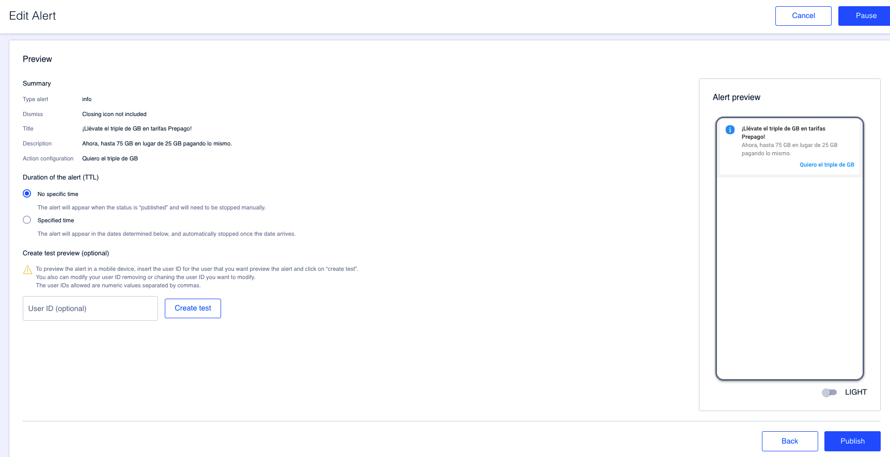

Preview
=======

This last step contains a summary of the alert you have configured. You can also set the validity of the alert in this step.

In addition, you can initiate a test to assess the content before it impacts users.

### Summary

Get a summary of the alert you have created:

* **Type of alert** . Type of alert you have created: informative, warning, promotional or error. 
* **Dismiss** . Indicate whether the alert has been configured to be closed or not.
* **Title** . Displays the title of the alert.   
  👋🏻 In the case of pre\-configured alerts, it is not possible to display the title. *Pre\-configured* will be indicated in this field.
* **Description** . Displays the alert description.  
  👋🏻 In the case of pre\-configured alerts it is not possible to display the description. *Pre\-configured description* will be indicated in this field.
* **Action configuration** . If you have configured one or two actions, the link texts will appear.  
  👋🏻 In the case of pre\-configured alerts it is not possible to display the description. *Pre\-configured description* will be indicated in this field.

### Duration of the alert

In this section you can configure, if necessary, the time for which the alert will be in effect.

* **No specific time** . Select this option if you do not want to set a specific validity for the alert. With this option the alert will be shown to the user if the audience that has been configured applies to him/her and if the alert is Published.
* **Specific time** . Select this option to indicate the start date and/or end date. In this case the alert will only be shown to the user for that time interval, and as long as the user belongs to the audience that has been configured for the alert and if it is Published.

Click **Save** to save the changes or **Save and Publish** to save and publish the changes.

### Create test preview \(optional\)

From this last step you can also create a test for the content that you have set up before it impacts a large mass of users. 

\{% hint style="success" %\}
🤓 This step is optional, although it is highly recommended that you run a test before publishing.
\{% endhint %\}

In the **User ID \(optional\)** field you can add one or more user IDs, separated only by commas \(no spaces\), on which you want to test. Click **Create test** to start the test and evaluate the content.

\{% hint style="info" %\}
**How to obtain the user ID** 

1. Make sure you have the Enterprise version of the app downloaded.
2. Open the app
3. Shake the phone
4. Access the "Authentication" section
5. the number you need is the one in the field **User ID** \{% endhint %\}

Need more information on how to test the content? 👇🏼

\{% content\-ref url="../como\-hacer\-un\-test.md" %\}
[como\-hacer\-un\-test.md](../como-hacer-un-test.md)
\{% endcontent\-ref %\}

